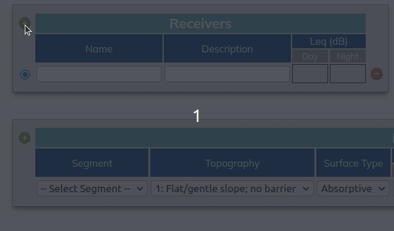

# Receiver

## What is a receiver?
An observation point at which sound is evaluated or measured. 
<br/><br/>

## Receiver Properties

### Receiver Name & Description
The Receiver ```name``` and ```description``` can be found in the Receivers section:

<br/><br/>

In STAMSON, the ```name``` and ```description```  are found within the Report tab:

<br/><br/>


### Receiver Distance & Height
In Noiise, ```height``` and ```distance``` are found in the Interactions Section. An interaction is simply the application of road traffic & shielding to a particular receiver. 

Receiver ```height``` defaults to 1.5m in both Noiise and STAMSON.  
Receiver ```distance``` defaults to 15m in both Noiise and STAMSON.


<br/><br/>

## How do you add Receivers?
Simply click the green + button located next to the 'Receivers' header. 
  
*A blank receiver is added by default.*
<br/><br/>

# Summary
With STAMSON, receivers need to be worked on one at a time. This is tedious and causes a user to lose sight of the bigger picture.
With Noiise, you're able to edit multiple receivers simultaneously. Managing a project becomes much easier this way as you retain a view of all your receivers on one page.
<br/><br/>
