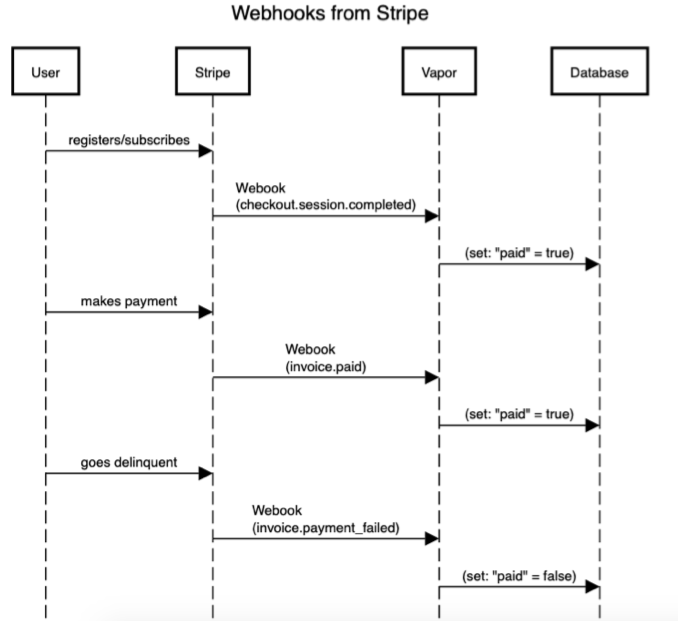
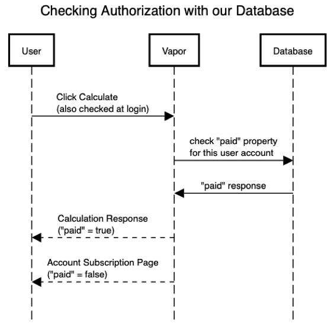

# Integrating with Stripe

## Preliminaries

First, we will probably want to install the Stripe CLI: ```brew install stripe/stripe-cli/stripe```  
Then we will define the pricing model using the CLI or the Dashboard. (We will most-likely just need a single fixed-price service).

## User Registers

We will create a checkout session that will call into one of our Vapor routes.
	•	The frontend will pass in the `price ID` (which we get from the pricing model)
	•	`success_url`: Where to send the user after they complete the payment.
	⁃	We might append the `session ID` to the `success_url`
	•	`cancel_url`: Where to send the user if they cancel the payment.

After the subscription signup succeeds, the customer is directed to the `success_url`, which initiates a `checkout.session.completed` webhook.

There may also be some sort of `user ID`.

## User Pays

	•	Every month when the user pays, we will receive an invoice.paid webhook.
	•	We will then update our database to mark the user’s as “paid” attribute to true.

## User Is Past Due

	•	If there is an issue with the payment for a particular month, we will receive an invoice.payment_failed webhook.
	•	We will then update our database to mark the user’s as “paid” attribute to false.  
  
  

## User Clicks Calculate

	•	We will check our database to see if “paid” is true for that user.
	•	If so, we will continue with the calculation request
	•	If not, we will redirect the user to some page.

  

## Summary

The user’s business with Stripe can happen independently. They can register, make payments, and fail to make payments. When any significant event like this happens, we’ll get notified through a webhook.

The webhooks are basically notifications that invoke our app to do something. In general, we’ll just be updating our database when these notifications come in.

In this sense, the user’s business with Noiise can rely solely on the payment status data we have for that user in our database.

Stripe in Vapor

StripeKit is a Swift package for communicating with the Stripe API for server-side Swift apps. We can use it to integrate with the webhooks.
https://github.com/vapor-community/stripe-kit

“Stripe” is a Vapor helper for StripeKit.
https://github.com/vapor-community/stripe
